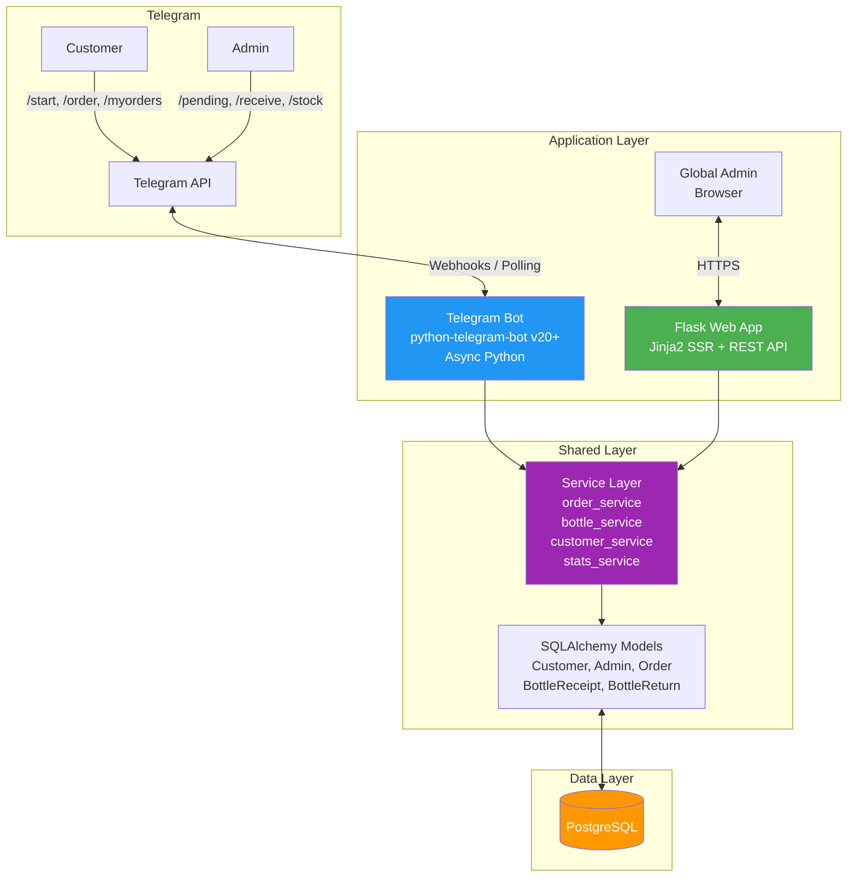
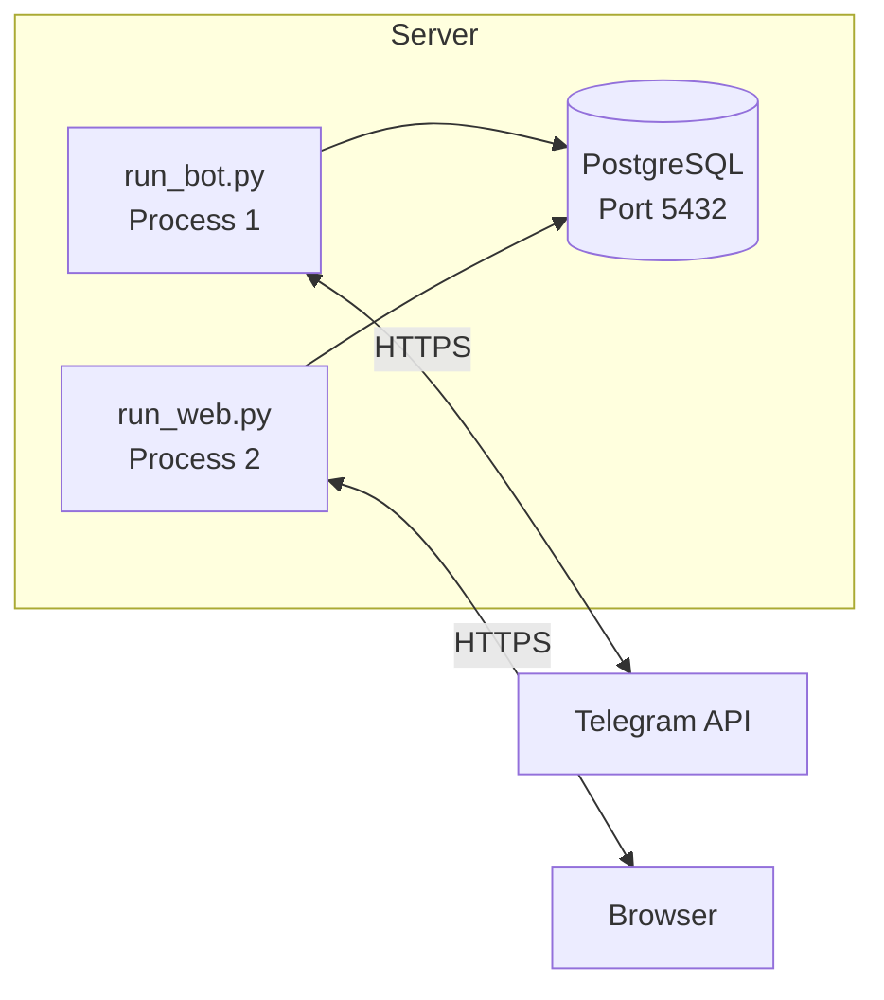

# 01 — System Overview

## 1. Purpose

A water distribution management system that enables:
- **Customers** to order water bottles via a Telegram bot
- **Admins** to manage orders and bottle inventory via the same Telegram bot
- **Global Admins** to monitor the entire operation via a web dashboard

## 2. Architecture

## 3. Component Descriptions

| Component | Technology | Responsibility |
|-----------|-----------|----------------|
| **Telegram Bot** | python-telegram-bot v20+ (async) | Handles all customer and admin interactions via Telegram. Uses `ConversationHandler` for multi-step flows. |
| **Flask Web App** | Flask 3.x + Jinja2 | Serves the admin dashboard (server-side rendered HTML) and REST API endpoints. Uses Flask-Login for authentication. |
| **Service Layer** | Plain Python classes | Shared business logic used by both bot and web. Contains order state machine, bottle stock calculations, customer management. |
| **SQLAlchemy Models** | SQLAlchemy 2.x ORM | Database models shared between bot and web. Single source of truth for schema. |
| **PostgreSQL** | PostgreSQL 15+ | Persistent storage for all application data. |

## 4. Actors

### 4.1 Customer
- **Identity**: Telegram user (identified by `telegram_id`)
- **Registration**: Must register (name, address, phone) before first order
- **Capabilities**: Place orders, view order history, cancel pending orders, view/edit profile
- **Channel**: Telegram bot only

### 4.2 Admin
- **Identity**: Telegram user pre-registered in `admins` table by a global admin
- **Capabilities**: View/claim pending orders, update order status, record bottle receipts from supplier, record customer bottle returns, look up customer stats, view own stock
- **Channel**: Telegram bot only
- **Multiplicity**: Multiple admins operate simultaneously; orders are claimed first-come-first-serve

### 4.3 Global Admin
- **Identity**: Username/password account in `global_admins` table
- **Capabilities**: Full read/write access to all data — orders, customers, admins, bottle inventory. Can add/deactivate admins.
- **Channel**: Web dashboard only

## 5. Tech Stack

| Layer | Technology | Version |
|-------|-----------|---------|
| Language | Python | 3.11+ |
| Telegram Bot | python-telegram-bot | 20.x |
| Web Framework | Flask | 3.x |
| Template Engine | Jinja2 | 3.x |
| ORM | SQLAlchemy | 2.x |
| Migrations | Alembic (Flask-Migrate) | 1.x |
| Database | PostgreSQL | 15+ |
| Auth (Web) | Flask-Login | 0.6.x |
| Forms (Web) | Flask-WTF | 1.x |
| Password Hashing | werkzeug.security | built-in |
| Environment Config | python-dotenv | 1.x |

## 6. Deployment Model

- Two separate Python processes sharing one database
- `run_bot.py` — starts the Telegram bot (long-polling or webhook)
- `run_web.py` — starts the Flask development server (or gunicorn in production)
- Both import from the shared `app/` package (models, services)

## 7. Communication Model

The bot uses **long-polling** by default for development simplicity. In production, switch to **webhooks** for lower latency and better resource usage. The `.env` file includes a `BOT_MODE` setting (`polling` or `webhook`) and webhook-specific config (`WEBHOOK_URL`, `WEBHOOK_PORT`).

## 8. Security Overview

| Concern | Approach |
|---------|----------|
| Customer authentication | Telegram `telegram_id` (cryptographically tied to account) |
| Admin authentication (bot) | `telegram_id` must exist in `admins` table with `is_active=TRUE` |
| Global admin authentication (web) | Username/password with session cookies via Flask-Login |
| Password storage | `werkzeug.security.generate_password_hash` (pbkdf2) |
| Password policy | Minimum 8 characters. First login forces password change (`must_change_password` flag). |
| Account lockout | 10 failed login attempts → account locked for 30 minutes |
| CSRF protection | Flask-WTF CSRF tokens on all forms |
| SQL injection | SQLAlchemy ORM with parameterized queries only |
| Secrets management | `.env` file excluded from version control |
| Rate limiting (web) | Flask-Limiter: 5 login attempts/min per IP, 60 API requests/min per session |
| Rate limiting (bot) | Max 3 pending orders per customer. 60-second duplicate order cooldown. |
| Input sanitization | Jinja2 auto-escaping for web output. Telegram markdown escaping for bot output. |
| CORS | Same-origin only (flask-cors with default deny) |
| Notification failures | Handled gracefully — never block status transitions. `notification_blocked` flag on customers. |
