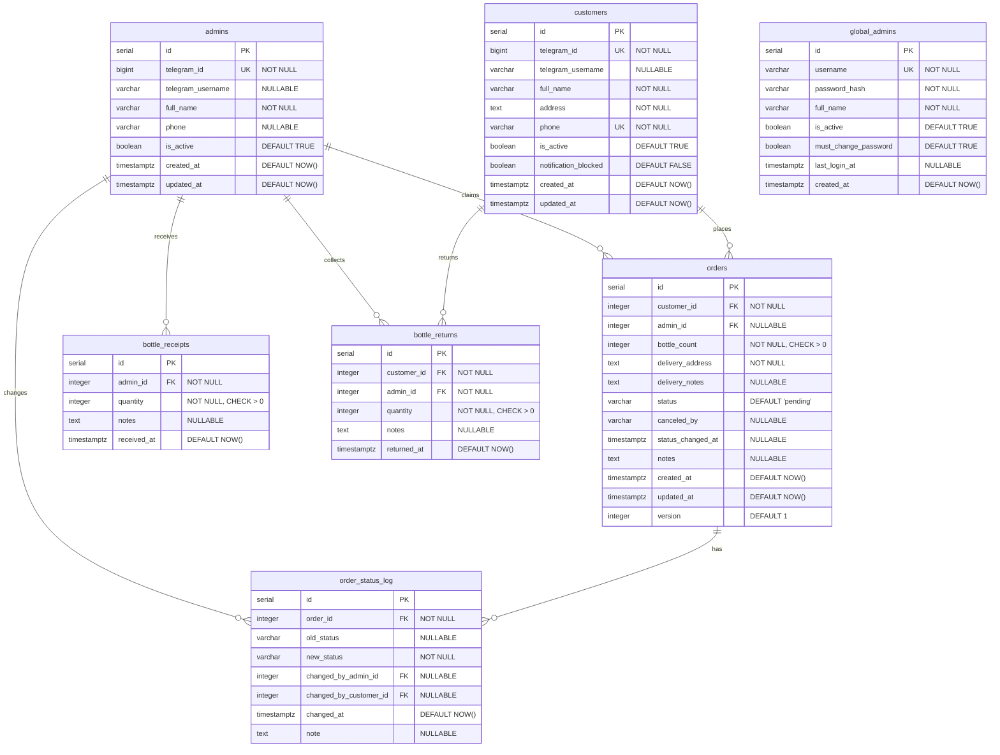
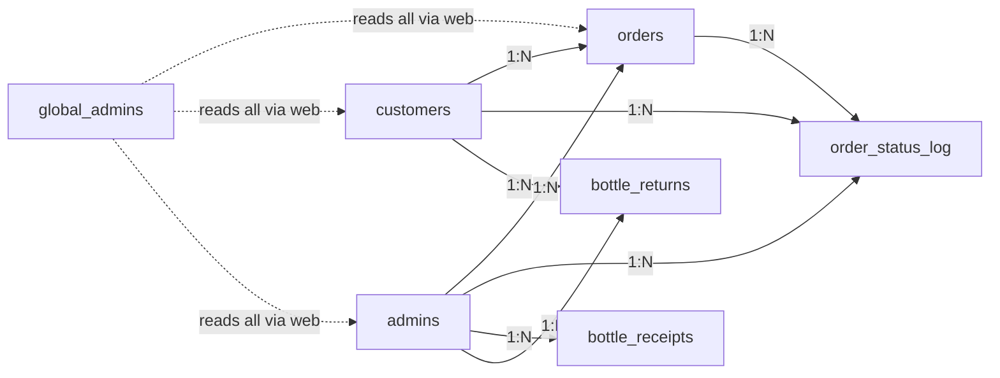

# 02 — Database Schema

## 1. Entity-Relationship Diagram

## 2. Table Definitions

### 2.1 `customers`

Registered Telegram users who order water.

| Column | Type | Constraints | Notes |
|--------|------|-------------|-------|
| `id` | `SERIAL` | `PRIMARY KEY` | Auto-increment |
| `telegram_id` | `BIGINT` | `UNIQUE NOT NULL` | Telegram user ID — immutable identifier |
| `telegram_username` | `VARCHAR(255)` | `NULLABLE` | Telegram @username — may be absent or change |
| `full_name` | `VARCHAR(255)` | `NOT NULL` | Collected during registration |
| `address` | `TEXT` | `NOT NULL` | Default delivery address |
| `phone` | `VARCHAR(20)` | `UNIQUE NOT NULL` | Contact number, stored normalized (digits + optional leading +) |
| `is_active` | `BOOLEAN` | `NOT NULL DEFAULT TRUE` | Soft-delete / ban flag |
| `notification_blocked` | `BOOLEAN` | `NOT NULL DEFAULT FALSE` | Set to TRUE when bot can't DM this customer (they blocked it) |
| `created_at` | `TIMESTAMPTZ` | `NOT NULL DEFAULT NOW()` | Registration timestamp |
| `updated_at` | `TIMESTAMPTZ` | `NOT NULL DEFAULT NOW()` | Last profile update |

**Indexes:**
- `ix_customers_telegram_id` on `telegram_id` (unique)
- `ix_customers_phone` on `phone` (unique)

---

### 2.2 `admins`

Telegram users authorized to manage orders and inventory. Pre-registered by a global admin.

| Column | Type | Constraints | Notes |
|--------|------|-------------|-------|
| `id` | `SERIAL` | `PRIMARY KEY` | |
| `telegram_id` | `BIGINT` | `UNIQUE NOT NULL` | Telegram user ID |
| `telegram_username` | `VARCHAR(255)` | `NULLABLE` | |
| `full_name` | `VARCHAR(255)` | `NOT NULL` | |
| `phone` | `VARCHAR(20)` | `NULLABLE` | |
| `is_active` | `BOOLEAN` | `NOT NULL DEFAULT TRUE` | Can be deactivated by global admin |
| `created_at` | `TIMESTAMPTZ` | `NOT NULL DEFAULT NOW()` | |
| `updated_at` | `TIMESTAMPTZ` | `NOT NULL DEFAULT NOW()` | Last profile modification |

**Indexes:**
- `ix_admins_telegram_id` on `telegram_id` (unique)

---

### 2.3 `global_admins`

Web dashboard users with full system access. No relationship to Telegram.

| Column | Type | Constraints | Notes |
|--------|------|-------------|-------|
| `id` | `SERIAL` | `PRIMARY KEY` | |
| `username` | `VARCHAR(100)` | `UNIQUE NOT NULL` | Login credential |
| `password_hash` | `VARCHAR(255)` | `NOT NULL` | `werkzeug.security.generate_password_hash` |
| `full_name` | `VARCHAR(255)` | `NOT NULL` | Display name |
| `is_active` | `BOOLEAN` | `NOT NULL DEFAULT TRUE` | |
| `must_change_password` | `BOOLEAN` | `NOT NULL DEFAULT TRUE` | Force password change on first login |
| `failed_login_attempts` | `INTEGER` | `NOT NULL DEFAULT 0` | Reset to 0 on successful login |
| `locked_until` | `TIMESTAMPTZ` | `NULLABLE` | Account locked after too many failed attempts |
| `last_login_at` | `TIMESTAMPTZ` | `NULLABLE` | Timestamp of last successful login |
| `created_at` | `TIMESTAMPTZ` | `NOT NULL DEFAULT NOW()` | |

---

### 2.4 `orders`

Water bottle orders placed by customers.

| Column | Type | Constraints | Notes |
|--------|------|-------------|-------|
| `id` | `SERIAL` | `PRIMARY KEY` | Order number displayed to users |
| `customer_id` | `INTEGER` | `NOT NULL REFERENCES customers(id)` | Who placed the order |
| `admin_id` | `INTEGER` | `NULLABLE REFERENCES admins(id)` | `NULL` = unassigned; set when admin claims |
| `bottle_count` | `INTEGER` | `NOT NULL CHECK (bottle_count > 0)` | Number of bottles requested |
| `delivery_address` | `TEXT` | `NOT NULL` | Copied from customer profile at order time, or overridden by customer |
| `delivery_notes` | `TEXT` | `NULLABLE` | Customer instructions: "leave at door", "call before", "gate code: 1234" |
| `status` | `VARCHAR(20)` | `NOT NULL DEFAULT 'pending'` | One of: `pending`, `in_progress`, `delivered`, `canceled` |
| `canceled_by` | `VARCHAR(20)` | `NULLABLE` | One of: `customer`, `admin`, `system`. Only set when status = `canceled` |
| `status_changed_at` | `TIMESTAMPTZ` | `NULLABLE` | Timestamp of last status transition |
| `notes` | `TEXT` | `NULLABLE` | Admin-facing notes (e.g., cancellation reason) |
| `created_at` | `TIMESTAMPTZ` | `NOT NULL DEFAULT NOW()` | Order placement time |
| `updated_at` | `TIMESTAMPTZ` | `NOT NULL DEFAULT NOW()` | Last modification |
| `version` | `INTEGER` | `NOT NULL DEFAULT 1` | Optimistic locking counter |

**Constraints:**
- `CHECK (status IN ('pending', 'in_progress', 'delivered', 'canceled'))`
- `CHECK (bottle_count > 0)`
- `CHECK (canceled_by IS NULL OR canceled_by IN ('customer', 'admin', 'system'))`
- `CHECK ((status = 'canceled') = (canceled_by IS NOT NULL))` — `canceled_by` must be set if and only if canceled

**Indexes:**
- `ix_orders_status` on `status`
- `ix_orders_customer_id` on `customer_id`
- `ix_orders_admin_id` on `admin_id`
- `ix_orders_created_at` on `created_at`
- `ix_orders_customer_status` on `(customer_id, status)` — for "my pending orders" queries

---

### 2.5 `order_status_log`

Audit trail for every order status change.

| Column | Type | Constraints | Notes |
|--------|------|-------------|-------|
| `id` | `SERIAL` | `PRIMARY KEY` | |
| `order_id` | `INTEGER` | `NOT NULL REFERENCES orders(id)` | |
| `old_status` | `VARCHAR(20)` | `NULLABLE` | `NULL` for initial creation |
| `new_status` | `VARCHAR(20)` | `NOT NULL` | |
| `changed_by_admin_id` | `INTEGER` | `NULLABLE REFERENCES admins(id)` | Set when admin initiates the change |
| `changed_by_customer_id` | `INTEGER` | `NULLABLE REFERENCES customers(id)` | Set when customer initiates (e.g., cancel) |
| `changed_at` | `TIMESTAMPTZ` | `NOT NULL DEFAULT NOW()` | |
| `note` | `TEXT` | `NULLABLE` | Reason for change |

**Indexes:**
- `ix_order_status_log_order_id` on `order_id`

---

### 2.6 `bottle_receipts`

Records of admin receiving **full** bottles from supplier.

| Column | Type | Constraints | Notes |
|--------|------|-------------|-------|
| `id` | `SERIAL` | `PRIMARY KEY` | |
| `admin_id` | `INTEGER` | `NOT NULL REFERENCES admins(id)` | Which admin received |
| `quantity` | `INTEGER` | `NOT NULL CHECK (quantity > 0)` | Number of full bottles |
| `notes` | `TEXT` | `NULLABLE` | Supplier name, invoice reference |
| `received_at` | `TIMESTAMPTZ` | `NOT NULL DEFAULT NOW()` | |

**Indexes:**
- `ix_bottle_receipts_admin_id` on `admin_id`
- `ix_bottle_receipts_received_at` on `received_at`

---

### 2.7 `bottle_returns`

Records of customers returning **empty** bottles to admins.

| Column | Type | Constraints | Notes |
|--------|------|-------------|-------|
| `id` | `SERIAL` | `PRIMARY KEY` | |
| `customer_id` | `INTEGER` | `NOT NULL REFERENCES customers(id)` | Who returned |
| `admin_id` | `INTEGER` | `NOT NULL REFERENCES admins(id)` | Who collected |
| `quantity` | `INTEGER` | `NOT NULL CHECK (quantity > 0)` | Number of empty bottles returned |
| `notes` | `TEXT` | `NULLABLE` | Context for the return (e.g., "damaged bottles", "final collection") |
| `returned_at` | `TIMESTAMPTZ` | `NOT NULL DEFAULT NOW()` | |

**Indexes:**
- `ix_bottle_returns_customer_id` on `customer_id`
- `ix_bottle_returns_admin_id` on `admin_id`

## 3. Relationships Summary

- `global_admins` has no foreign key to other tables — it accesses everything through the web dashboard
- `orders.admin_id` is nullable — `NULL` means the order is unassigned (pending)
- `orders.delivery_address` is copied from customer profile at order time, allowing per-order overrides
- `order_status_log` tracks both admin-initiated and customer-initiated changes via separate FK columns
- All timestamps use `TIMESTAMPTZ` for timezone-aware storage

## 4. Key Design Decisions

### 4.1 Full vs Empty Bottles
The system distinguishes between **full bottles** (from supplier, ready to deliver) and **empty bottles** (returned by customers). `bottle_receipts` tracks full bottles. `bottle_returns` tracks empties. Admin stock only counts full bottles. Empty bottles collected by admins are tracked for customer accountability but are not added back to deliverable stock.

### 4.2 Phone Uniqueness
`customers.phone` has a UNIQUE constraint. Two customers cannot register with the same phone number. This prevents ambiguity when admins look up customers by phone during the `/returns` flow.

### 4.3 Delivery Address on Orders
Each order stores its own `delivery_address`, copied from the customer's profile at order time. If the customer changes their address for a specific order, only that order's `delivery_address` is affected — the profile remains unchanged. This is important because:
- Past orders retain the address they were delivered to (audit trail)
- Customers can order to a different location without changing their profile

### 4.4 Account Lockout
`global_admins` implements account lockout via `failed_login_attempts` and `locked_until`. After 10 consecutive failed login attempts, the account is locked for 30 minutes (configurable). This prevents brute-force attacks on the web dashboard.
