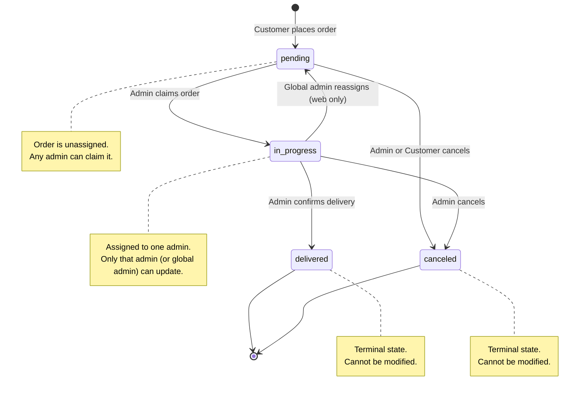
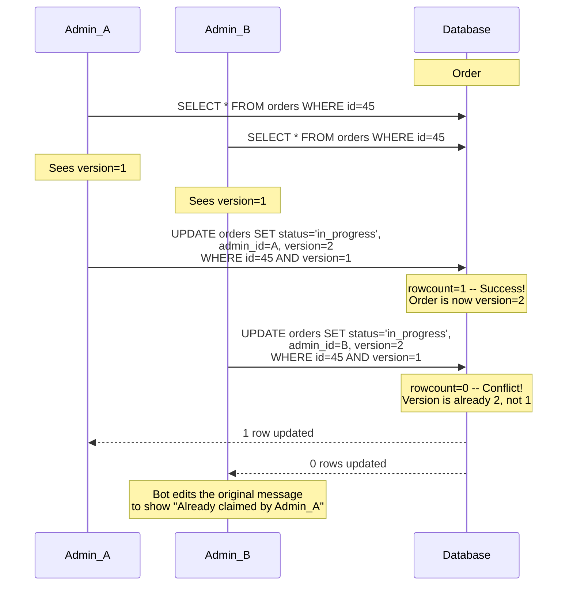
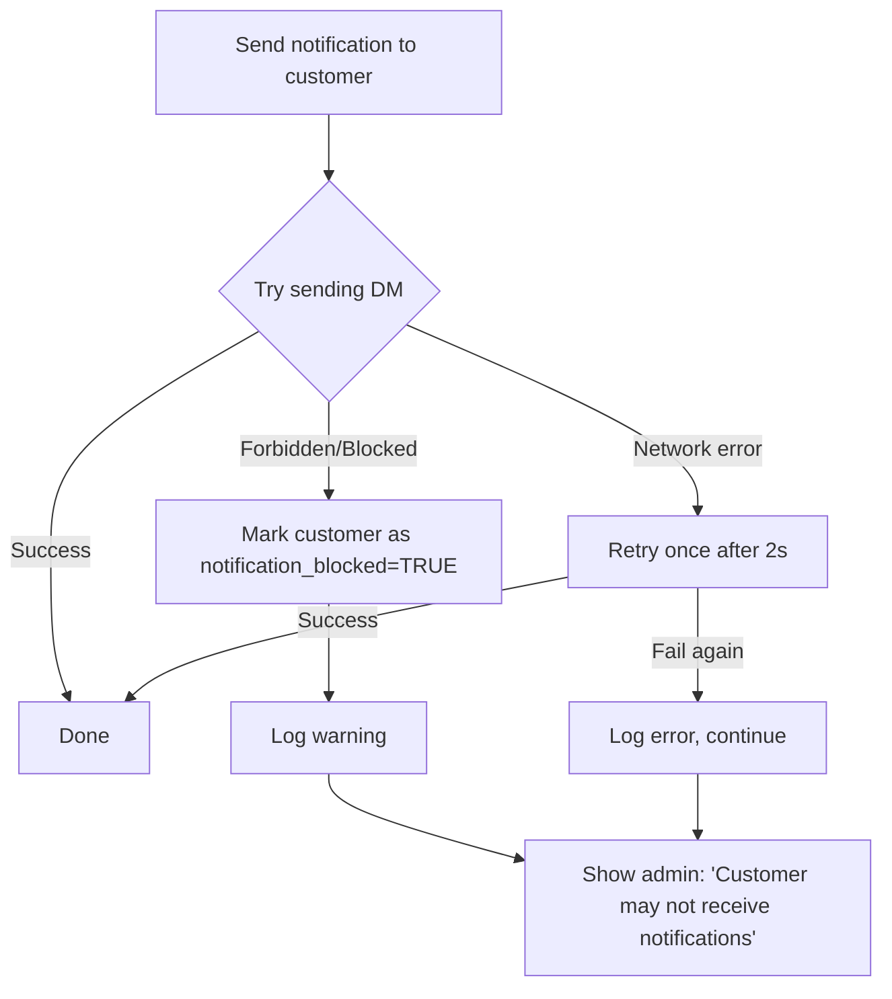

# 03 — Order State Machine

## 1. State Diagram



## 2. States

| State | Description | `admin_id` | Who Can Modify |
|-------|-------------|-----------|----------------|
| `pending` | Order placed, waiting for an admin to claim | `NULL` | Any admin (claim), customer (cancel), global admin (cancel via web) |
| `in_progress` | Admin claimed the order, preparing for delivery | Set to claiming admin | Assigned admin only (bot), global admin (web — reassign or cancel) |
| `delivered` | Order fulfilled, bottles handed to customer | Remains set | **Terminal — no further changes** |
| `canceled` | Order canceled before delivery | May be `NULL` or set | **Terminal — no further changes** |

## 3. Valid Transitions

| From | To | Triggered By | Preconditions | Side Effects |
|------|----|-------------|---------------|-------------|
| _(new)_ | `pending` | System | Customer is registered. Customer has < `MAX_PENDING_ORDERS` pending. No duplicate order within 60s cooldown. | 1. INSERT order (with `delivery_address` from profile or override)<br>2. INSERT status log (old=NULL, new=pending, changed_by_customer_id set)<br>3. Notify admin group: "New order #{id}" with [Claim] button |
| `pending` | `in_progress` | Any admin | Order is unclaimed (`admin_id IS NULL`) | 1. SET `admin_id`, `status`, `version += 1`<br>2. INSERT status log (changed_by_admin_id set)<br>3. Notify customer: "Your order is being prepared" (handle blocked customers gracefully) |
| `pending` | `canceled` | Admin, Customer, or Global Admin | — | 1. SET `status`, `canceled_by` (`'customer'`, `'admin'`, or `'system'`), `version += 1`<br>2. INSERT status log with reason and appropriate `changed_by_*` column<br>3. Notify customer if admin-initiated (handle blocked gracefully)<br>4. Notify admin group if customer-initiated |
| `in_progress` | `delivered` | Assigned admin only | `admin_stock >= order.bottle_count` | 1. SET `status`, `version += 1`<br>2. INSERT status log<br>3. Notify customer: "Your order has been delivered" (handle blocked gracefully)<br>4. Admin stock decremented (via delivered order sum) |
| `in_progress` | `canceled` | Assigned admin or Global Admin | — | 1. SET `status`, `canceled_by` (`'admin'`), `version += 1`<br>2. INSERT status log with reason<br>3. Notify customer (handle blocked gracefully)<br>4. `admin_id` retained for audit trail |
| `in_progress` | `pending` | Global Admin (web only) | Used for reassignment when admin is unavailable | 1. SET `status='pending'`, `admin_id=NULL`, `version += 1`<br>2. INSERT status log with note "Reassigned by global admin"<br>3. Notify original admin: "Order #{id} was unassigned from you"<br>4. Notify admin group: "Order #{id} is available for pickup" |

## 4. Invalid Transitions

| Attempted Transition | Reason |
|---------------------|--------|
| `delivered` → anything | Terminal state. If delivery was wrong, record a `bottle_return` instead. |
| `canceled` → anything | Terminal state. Customer must place a new order. |
| `in_progress` → `pending` (via bot) | Regular admins cannot un-claim. Only global admin via web can reassign. |
| Non-assigned admin → update `in_progress` order | Only the admin who claimed (`admin_id` matches) can modify via bot. |
| Customer → cancel `in_progress` order | Once claimed, customer cannot cancel. They see: "This order is being prepared. Contact your delivery admin at {admin_phone}." |

## 5. Optimistic Locking

The `orders.version` column prevents race conditions when multiple admins interact with the same order simultaneously.

### How It Works



### Implementation Pattern

```python
def claim_order(session, order_id: int, admin_id: int, expected_version: int) -> Order | None:
    """Returns the updated Order on success, or None on conflict."""
    result = session.execute(
        update(Order)
        .where(
            Order.id == order_id,
            Order.status == 'pending',
            Order.version == expected_version,
        )
        .values(
            status='in_progress',
            admin_id=admin_id,
            version=Order.version + 1,
            status_changed_at=func.now(),
            updated_at=func.now(),
        )
        .returning(Order)  # Return updated row
    )
    if result.rowcount == 0:
        session.rollback()
        return None  # Conflict
    
    order = result.scalar_one()
    # Insert audit log
    session.add(OrderStatusLog(
        order_id=order_id,
        old_status='pending',
        new_status='in_progress',
        changed_by_admin_id=admin_id,
    ))
    session.commit()
    return order
```

## 6. Duplicate Order Prevention

Before creating an order, the system checks:

```python
def can_create_order(session, customer_id: int, bottle_count: int) -> tuple[bool, str]:
    # Check 1: Max pending orders
    pending_count = session.query(func.count(Order.id)).filter(
        Order.customer_id == customer_id,
        Order.status.in_(['pending', 'in_progress']),
    ).scalar()
    
    if pending_count >= MAX_PENDING_ORDERS_PER_CUSTOMER:  # default: 3
        return False, f"You already have {pending_count} active orders. Please wait or cancel one."
    
    # Check 2: Cooldown (prevent double-tap)
    recent = session.query(Order).filter(
        Order.customer_id == customer_id,
        Order.bottle_count == bottle_count,
        Order.created_at > func.now() - timedelta(seconds=60),
    ).first()
    
    if recent:
        return False, f"You just placed a similar order (#{recent.id}). Please wait a moment."
    
    return True, ""
```

## 7. Notification Failure Handling



**Key principle:** Notification failures must never block order status transitions. The status update is the primary operation; notification is best-effort.

If a customer has `notification_blocked = TRUE`:
- Admin sees a warning when viewing/claiming their order: "This customer may not receive bot notifications."
- The notification is still attempted (customer may have unblocked), and `notification_blocked` is reset to FALSE on success.

## 8. Edge Cases

| Scenario | Handling |
|----------|---------|
| **Customer orders 0 bottles** | DB CHECK constraint rejects. Bot validates `bottle_count > 0` before INSERT. |
| **Customer orders > 50 bottles** | Configurable max (`MAX_BOTTLES_PER_ORDER`). Bot validates before INSERT. |
| **Customer has 3+ pending orders** | Rejected with message. Configurable via `MAX_PENDING_ORDERS_PER_CUSTOMER`. |
| **Customer double-taps Confirm** | 60-second cooldown on same `(customer_id, bottle_count)`. Second attempt shows "You just placed a similar order." |
| **Cancel after delivery** | Rejected. `delivered` is terminal. Admin records a `bottle_return` if incorrect. |
| **Two admins claim simultaneously** | Optimistic locking: exactly one succeeds, the other gets a conflict message with updated info. |
| **Admin claims but never delivers** | Dashboard flags stale `in_progress` orders (> configurable hours). Global admin can reassign via web (in_progress → pending with admin_id cleared). |
| **Admin deactivated with active orders** | Web panel enforces: must reassign or cancel active orders before deactivation. |
| **Customer sends /cancel for in_progress order** | Bot responds: "This order is being prepared by {admin_name}. Contact them at {admin_phone} to discuss changes." |
| **Network failure during status update** | Optimistic locking + DB transaction ensure atomicity. Either the full update applies or nothing changes. |
| **Stale inline keyboard button pressed** | On conflict, bot edits the original message to show current order status instead of just an error. |
| **Customer blocked the bot** | Notification fails gracefully. `notification_blocked` flag set. Admin warned. Status transition still completes. |
| **Global admin reassigns in_progress order** | Order goes back to `pending` with `admin_id = NULL`. Original admin notified. New [Claim] notification sent to admin group. |
