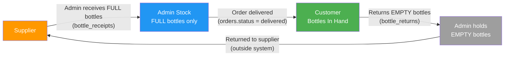
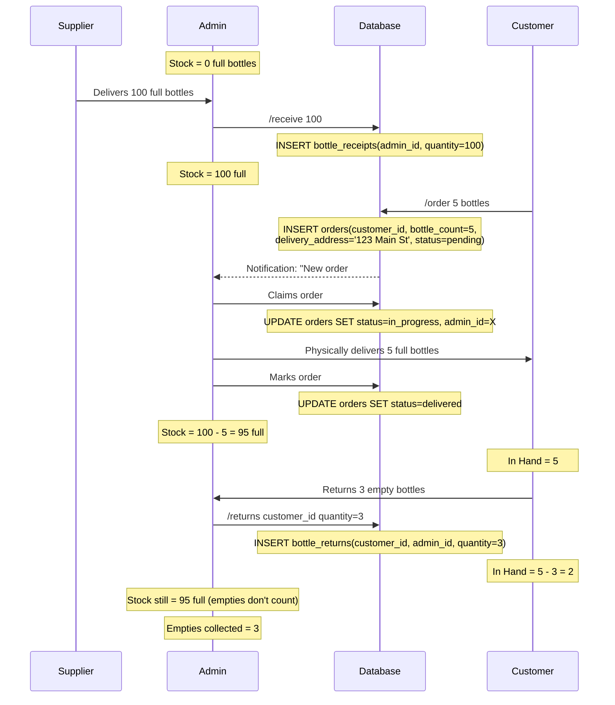

# 04 — Bottle Inventory Tracking

## 1. Full vs Empty Bottles

The system tracks two distinct types of bottles:

| Type | Description | Tracked In | Flow Direction |
|------|-------------|-----------|---------------|
| **Full bottles** | Sealed bottles ready for delivery | `bottle_receipts`, `orders` | Supplier → Admin → Customer |
| **Empty bottles** | Used bottles returned by customer | `bottle_returns` | Customer → Admin (→ Supplier, outside system) |

**Important:** Empty bottles returned by customers do NOT add back to admin's deliverable stock. They are tracked only for customer accountability (how many bottles a customer currently holds). The admin collects empties and returns them to the supplier outside this system.

## 2. Bottle Flow



The system tracks bottles through three stages:
1. **Supplier → Admin**: Admin records receiving full bottles from supplier (`bottle_receipts` table)
2. **Admin → Customer**: When order is marked `delivered`, full bottles move from admin stock to customer
3. **Customer → Admin**: Customer returns empty bottles, recorded by admin (`bottle_returns` table). These reduce the customer's "in hand" count but do NOT increase the admin's deliverable stock.

## 3. Stock Formulas

### 3.1 Admin Stock (full bottles available to deliver)

```
admin_stock(admin_id) =
    SUM(bottle_receipts.quantity WHERE admin_id = :admin_id)
  - SUM(orders.bottle_count WHERE admin_id = :admin_id AND status = 'delivered')
```

**Note:** This formula intentionally excludes returned empties. Admin stock = full bottles only.

### 3.2 Admin Empties Collected

```
admin_empties(admin_id) =
    SUM(bottle_returns.quantity WHERE admin_id = :admin_id)
```

Informational only — displayed on admin dashboard for reference.

### 3.3 Customer Bottles In Hand

```
customer_delivered(customer_id) =
    SUM(orders.bottle_count WHERE customer_id = :customer_id AND status = 'delivered')

customer_returned(customer_id) =
    SUM(bottle_returns.quantity WHERE customer_id = :customer_id)

customer_bottles_in_hand(customer_id) =
    customer_delivered - customer_returned
```

"In hand" = total full bottles delivered to customer minus total empties returned. This represents the customer's bottle accountability.

### 3.4 Customer Order Stats

```
customer_total_ordered(customer_id) =
    SUM(orders.bottle_count WHERE customer_id = :customer_id AND status != 'canceled')

customer_total_delivered(customer_id) =
    SUM(orders.bottle_count WHERE customer_id = :customer_id AND status = 'delivered')

customer_total_pending(customer_id) =
    SUM(orders.bottle_count WHERE customer_id = :customer_id AND status IN ('pending', 'in_progress'))

customer_total_canceled(customer_id) =
    SUM(orders.bottle_count WHERE customer_id = :customer_id AND status = 'canceled')
```

### 3.5 Global Stats

```
total_bottles_received    = SUM(all bottle_receipts.quantity)
total_bottles_delivered   = SUM(orders.bottle_count WHERE status = 'delivered')
total_bottles_pending     = SUM(orders.bottle_count WHERE status IN ('pending', 'in_progress'))
total_bottles_returned    = SUM(all bottle_returns.quantity)
total_admin_stock         = total_bottles_received - total_bottles_delivered
total_customer_in_hand    = total_bottles_delivered - total_bottles_returned
total_empties_collected   = total_bottles_returned
```

## 4. Inventory Lifecycle Diagram



## 5. Recording Events

| Event | Table | Who Triggers | Bot Command | Effect on Admin Stock |
|-------|-------|-------------|-------------|----------------------|
| Admin receives full bottles from supplier | `bottle_receipts` | Admin | `/receive` | **Increases** by quantity |
| Order marked as delivered | `orders` (status update) | Admin | [Delivered] button on `/myactive` | **Decreases** by bottle_count |
| Customer returns empty bottles | `bottle_returns` | Admin (records on behalf of customer) | `/returns` | **No change** (empties, not full) |

## 6. Validation Rules

### 6.1 Delivery Validation (Insufficient Stock Guard)

When admin marks an order as `delivered`:

```
IF admin_stock(admin_id) < order.bottle_count THEN
    REJECT with message:
    "Insufficient stock. You have {stock} full bottles but this order requires {order.bottle_count}.
     Use /receive to record a new bottle receipt from your supplier."
```

This prevents delivering more bottles than the admin has in stock.

### 6.2 Return Validation

When admin records a bottle return:

```
IF quantity > customer_bottles_in_hand(customer_id) THEN
    REJECT with message:
    "Cannot return {quantity} bottles. {customer_name} only has {in_hand} bottles in hand."

IF quantity <= 0 THEN
    REJECT with message:
    "Please enter a positive number."
```

### 6.3 Receipt Validation

```
IF quantity <= 0 THEN REJECT
IF quantity > MAX_RECEIPT_QUANTITY (default 1000) THEN
    WARN: "That's a large receipt ({quantity} bottles). Are you sure? [Confirm] [Cancel]"
```

### 6.4 Delivery with Insufficient Stock — Admin Options

When stock is insufficient, the bot should offer actionable next steps:

```
"Insufficient stock. You have 3 bottles but this order needs 5.

Options:
[Record Receipt] — Use /receive if you've gotten more bottles
[View Stock] — Use /stock to check your full inventory
```

## 7. Stock Summary View (per admin)

Displayed by `/stock` command:

```
Your Bottle Inventory
-----------------------------
Full bottles (from supplier):  200
Delivered to customers:        145
Current stock (full):           55
-----------------------------
Empties collected:              80
-----------------------------
Pending deliveries:  12 bottles across 4 orders

Warning: You need 12 bottles for pending deliveries
and have 55 in stock. You're covered.
```

If stock is lower than pending deliveries:
```
Warning: You need 30 bottles for pending deliveries
but only have 12 in stock. Use /receive to restock!
```

## 8. Customer Bottle View (per customer)

Displayed in `/profile` and admin's `/customer` lookup:

```
Bottle Stats for John Doe
-----------------------------
Total ordered:      60
Total delivered:    55
Total returned:     30
Currently in hand:  25
Pending orders:      5 bottles (1 order)
Canceled:            5 bottles
```

## 9. Dashboard Global View

Displayed on web dashboard overview:

```
Global Bottle Inventory
-----------------------------
Full bottles received (all admins):  500
Full bottles delivered (all orders): 380
Full bottles in admin stock:         120
-----------------------------
Empty bottles returned by customers: 200
Bottles still with customers:        180
-----------------------------
Pending delivery:  45 bottles across 12 orders
```

## 10. Stock Warnings

The system proactively warns admins about stock issues:

| Condition | Warning | Where Shown |
|-----------|---------|-------------|
| `admin_stock < 10` | "Low stock! You have only {n} bottles left." | After `/receive`, after delivery, in `/stock` |
| `admin_stock < pending_bottles` | "You don't have enough stock for all pending deliveries." | In `/stock`, in daily summary |
| `admin_stock == 0` | "You have no bottles in stock! Use /receive before delivering." | When trying to mark delivered |
