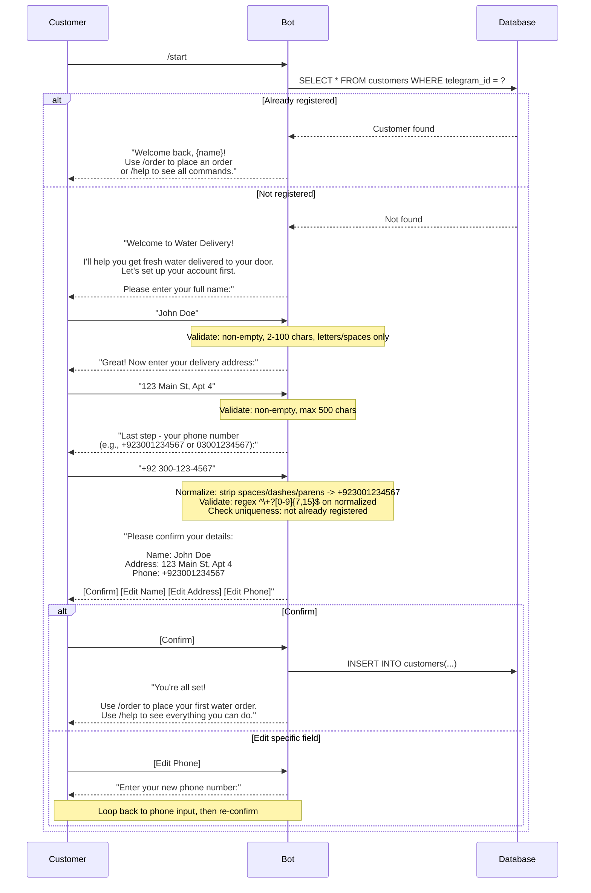
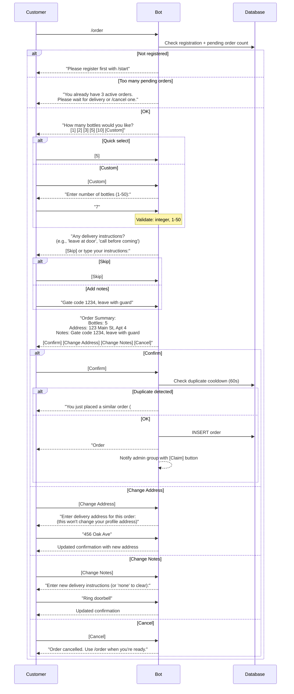
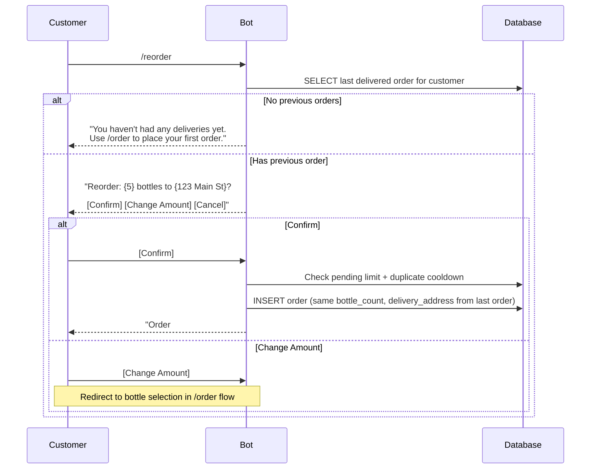
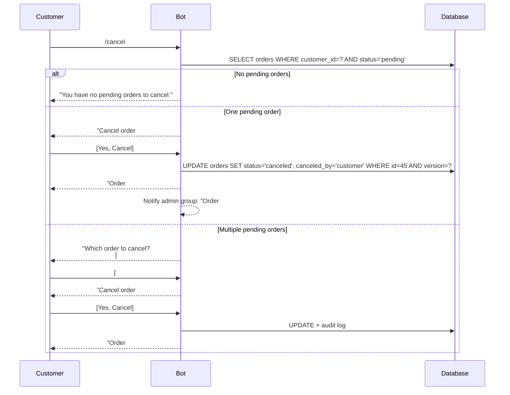
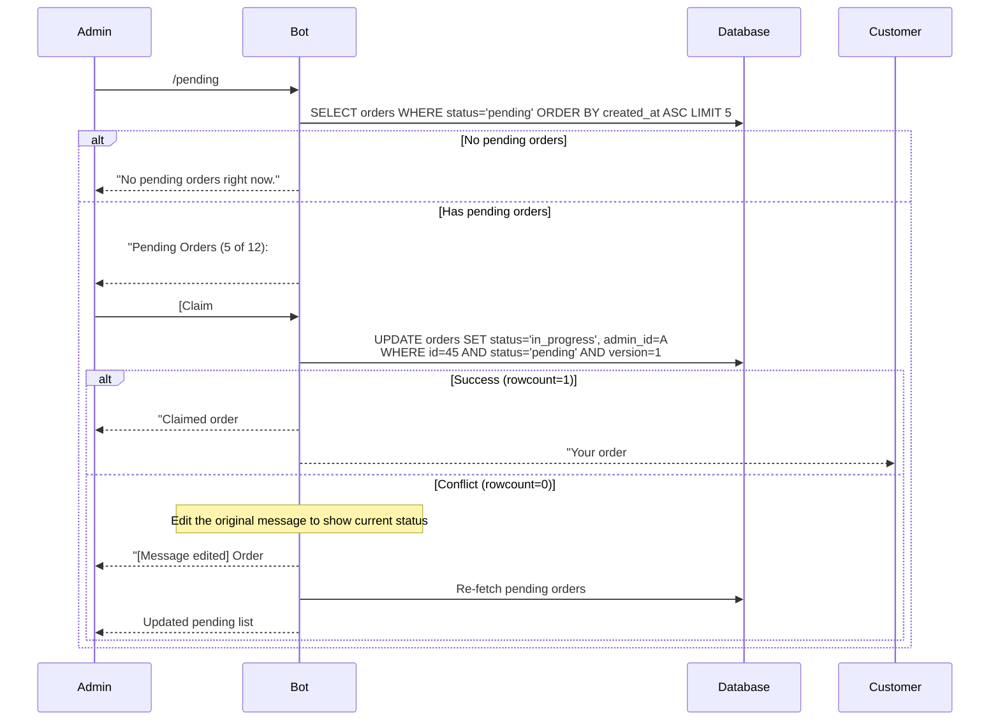
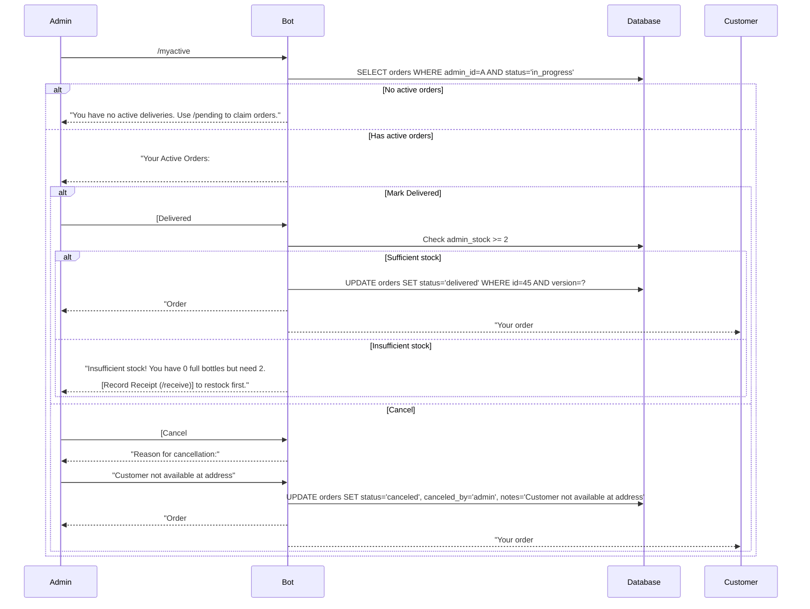
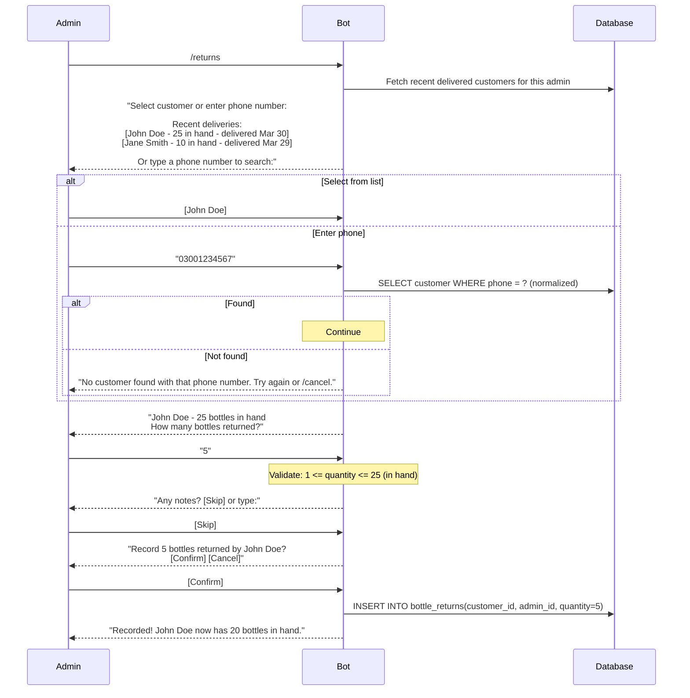
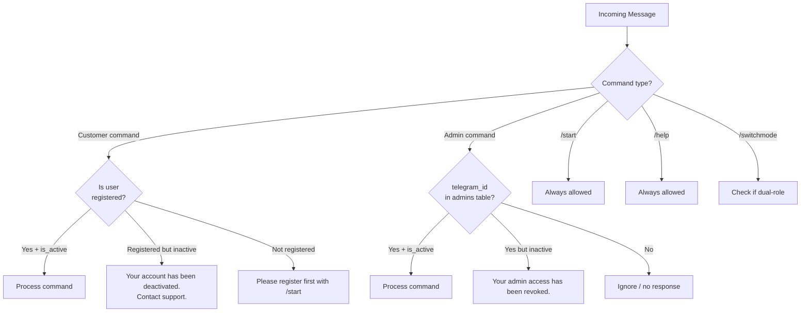

# 05 — Telegram Bot Flows

## 1. Command Overview

### Customer Commands
| Command | Description | Requires Registration |
|---------|-------------|----------------------|
| `/start` | Welcome message + registration flow | No |
| `/order` | Place a new water order | Yes |
| `/reorder` | Repeat last delivered order with one tap | Yes |
| `/myorders` | View order history and status (paginated) | Yes |
| `/cancel` | Cancel a pending order | Yes |
| `/profile` | View and edit profile | Yes |
| `/help` | Show available commands | No |

### Admin Commands
| Command | Description |
|---------|-------------|
| `/pending` | View and claim pending orders (paginated) |
| `/myactive` | View orders assigned to you (in_progress) |
| `/receive` | Record bottles received from supplier |
| `/returns` | Record bottle returns from a customer |
| `/customer` | Look up a customer's stats |
| `/stock` | View your bottle inventory |
| `/help` | Show admin commands |

### Dual-Role Commands
| Command | Description |
|---------|-------------|
| `/switchmode` | Switch between customer and admin mode (only for dual-role users) |

### Bot Menu Commands (setMyCommands)

On startup, the bot registers scoped menus with Telegram:

**Default scope (customers):**
```
start    - Register or see welcome message
order    - Order water bottles
reorder  - Repeat your last order
myorders - View your order history
cancel   - Cancel a pending order
profile  - View or edit your profile
help     - Show available commands
```

**Admin scope (set per admin user):**
```
pending  - View pending orders
myactive - Your in-progress orders
receive  - Record bottles from supplier
returns  - Record customer bottle returns
customer - Look up a customer
stock    - Your bottle inventory
help     - Show admin commands
```

---

## 2. Conversation Handler Defaults

All `ConversationHandler` instances share these defaults:

| Setting | Value | Reason |
|---------|-------|--------|
| `conversation_timeout` | 600 seconds (10 min) | Prevent abandoned conversations from lingering |
| Timeout message | "This conversation timed out. Please start again with /{command}." | Inform user clearly |
| `/cancel` fallback | Available in every conversation | User can always escape |
| Invalid input | Re-prompt with specific error + expected format | Never silently drop input |
| Persistence | `PicklePersistence` or PostgreSQL-backed | Survive bot restarts |

---

## 3. Customer Flows

### 3.1 Registration Flow (`/start`)



**ConversationHandler states:**
- `ENTER_NAME` → `ENTER_ADDRESS` → `ENTER_PHONE` → `CONFIRM_REGISTRATION`
- Edit loops: each edit button goes back to the specific input state, then returns to confirm
- Fallback: `/cancel` exits with "Registration cancelled. Use /start whenever you're ready."
- Timeout: 10 minutes → "Registration timed out. Use /start to try again."

**Phone number normalization:**
Input like `(092) 300-123-4567`, `+92 300 123 4567`, `03001234567` all normalize to `+923001234567` (or `03001234567` if no country code). Strip all non-digit characters except leading `+`, then validate.

---

### 3.2 Place Order Flow (`/order`)



**ConversationHandler states:**
- `SELECT_BOTTLES` → `CUSTOM_AMOUNT` (optional) → `DELIVERY_NOTES` → `CONFIRM_ORDER` → `CHANGE_ADDRESS` / `CHANGE_NOTES` (optional loops)

---

### 3.3 Reorder (`/reorder`)



---

### 3.4 View Orders (`/myorders`)

```
Customer sends: /myorders

Bot responds:
Your Orders (page 1/3)
-----------------------------
#48 | 3 bottles | Delivered    | Mar 30
#47 | 5 bottles | In Progress  | Mar 29
#45 | 2 bottles | Pending      | Mar 28
#42 | 5 bottles | Canceled     | Mar 25
#40 | 3 bottles | Delivered    | Mar 20

[< Prev] Page 1 of 3 [Next >]
```

- Fetches orders in pages of 5, ordered by `created_at DESC`
- Status display: Pending, In Progress, Delivered, Canceled (plain text, no emojis)
- If no orders: "No orders yet. Use /order to get started."
- Inline keyboard for pagination: [< Prev] [Next >]

---

### 3.5 Cancel Order (`/cancel`)



**In-progress orders:** If customer has only in_progress orders, bot responds: "Your order #{id} is already being prepared by {admin_name}. If you need to change it, contact them at {admin_phone}."

---

### 3.6 Profile (`/profile`)

```
Customer sends: /profile

Bot responds:
Your Profile
-----------------------------
Name:    John Doe
Address: 123 Main St, Apt 4
Phone:   +923001234567

Bottle Stats
-----------------------------
Total ordered:      60
Total delivered:    55
Returned:           30
Currently in hand:  25
Pending:            5 bottles (1 order)

[Edit Name] [Edit Address] [Edit Phone]
```

Edit flow: Tap [Edit Address] → "Enter your new address:" → Enter → "Address updated to: 456 Oak Ave" → Done.

---

## 4. Admin Flows

### 4.1 View & Claim Pending Orders (`/pending`)



**Pagination:** 5 orders per page with [< Prev] [Next >] buttons. Shows total count in header.

---

### 4.2 My Active Orders (`/myactive`)



---

### 4.3 Receive Bottles (`/receive`)

```
Admin sends: /receive

Bot: "How many bottles did you receive from the supplier?"

Admin: "50"

Bot: "Any notes? (supplier name, invoice number, etc.)
     [Skip] or type your notes:"

Admin: "Weekly delivery from AquaPure, Invoice #2345"

Bot: "Record receipt of 50 bottles?
     Notes: Weekly delivery from AquaPure, Invoice #2345
     [Confirm] [Cancel]"

Admin: [Confirm]

Bot: "Recorded! 50 bottles added to your stock.
     
     Your current stock: 95 full bottles.
     Empties collected: 30"
```

**ConversationHandler states:** `ENTER_QUANTITY` → `ENTER_NOTES` → `CONFIRM_RECEIPT`

**Validation:**
- Must be positive integer
- Max 1000 (configurable `MAX_RECEIPT_QUANTITY`). Over 1000 triggers an extra confirmation: "That's a large receipt. Are you sure?"

---

### 4.4 Record Bottle Returns (`/returns`)



---

### 4.5 Customer Lookup (`/customer`)

```
Admin sends: /customer

Bot: "Enter customer name or phone number:"

Admin: "John"

Bot: (searches ILIKE '%john%' on name, or exact match on normalized phone)
"Found 2 customers:
[John Doe - +923001234567]
[Johnny Smith - +923009876543]"

Admin: [John Doe - +923001234567]

Bot:
"John Doe
-----------------------------
Phone:      +923001234567
Address:    123 Main St, Apt 4
Registered: Jan 15, 2026
Status:     Active

Bottle Stats
-----------------------------
Total ordered:     60
Total delivered:   55
Returned:          30
In hand:           25
Pending:           5 (1 order)

Recent Orders
-----------------------------
#48 | 3 bottles | Pending      | Mar 30
#45 | 5 bottles | Delivered    | Mar 28
#42 | 5 bottles | Delivered    | Mar 25"
```

**If customer has `notification_blocked = TRUE`:**
```
Warning: This customer may not receive bot notifications (they may have blocked the bot).
```

---

### 4.6 View Stock (`/stock`)

```
Admin sends: /stock

Bot:
"Your Bottle Inventory
-----------------------------
Received from supplier:  200
Delivered to customers:  145
Current stock (full):     55
-----------------------------
Empties collected:        80
-----------------------------
Pending deliveries: 12 bottles across 4 orders

You have enough stock for pending deliveries."
```

Or if low stock:
```
"Warning: You need 30 bottles for pending deliveries but only have 12.
Use /receive to record a new receipt from your supplier."
```

---

## 5. Notification Triggers

| Event | Recipient | Message | On Failure |
|-------|-----------|---------|------------|
| New order placed | Admin group / all admins | "New order #{id}: {bottles} bottles\n{name} at {address}\nNotes: {notes}" with [Claim] button | Log error, retry once |
| Order claimed | Customer | "Your order #{id} is being prepared for delivery!" | Set `notification_blocked`, warn admin |
| Order delivered | Customer | "Your order #{id} has been delivered!" | Set `notification_blocked`, warn admin |
| Order canceled by admin | Customer | "Your order #{id} was canceled.\nReason: {reason}\n\nUse /order to place a new order." | Set `notification_blocked`, warn admin |
| Order canceled by customer | Admin group | "Order #{id} was canceled by the customer." | Log error |
| Order reassigned by global admin | Original admin | "Order #{id} was unassigned from you by a global admin." | Log error |
| Low stock warning | Admin (after delivery) | "Low stock warning! You have {n} bottles remaining." | Log error |

---

## 6. Input Validation Rules

| Field | Raw Input | Normalization | Validation | Error Message |
|-------|-----------|--------------|------------|---------------|
| Full name | Any text | Trim whitespace | 2-100 chars, letters/spaces/hyphens | "Please enter a valid name (2-100 characters, letters only)." |
| Address | Any text | Trim whitespace | Non-empty, max 500 chars | "Please enter a valid address (max 500 characters)." |
| Phone | `+92 300-123-4567` | Strip spaces, dashes, parens → `+923001234567` | Regex `^\+?[0-9]{7,15}$` on normalized | "Please enter a valid phone number (e.g., +923001234567 or 03001234567)." |
| Bottle count (order) | `"7"` | Strip whitespace | Integer, 1-50 (configurable) | "Please enter a number between 1 and {max}." |
| Bottle count (receipt) | `"50"` | Strip whitespace | Integer, 1-1000 (configurable) | "Please enter a valid quantity (1-{max})." |
| Bottle count (return) | `"5"` | Strip whitespace | Integer, 1-customer_in_hand | "Invalid. {name} only has {n} bottles in hand." |
| Delivery notes | Any text | Trim whitespace | Max 500 chars, optional | "Delivery notes too long (max 500 characters)." |

---

## 7. Authorization Middleware



**Decorator pattern:**
- `@require_customer` — checks customer exists, is active
- `@require_admin` — checks admin exists, is active
- Unauthorized users get no indication that admin commands exist (silent ignore)
- Deactivated users get a specific message so they understand why

---

## 8. Dual Role Handling

If a `telegram_id` exists in both `customers` and `admins` tables:

```
User sends: /start

Bot: "Welcome! You have both customer and admin access.
Choose your mode:
[Customer Mode] [Admin Mode]"
```

- Mode choice stored in `context.user_data['role']` (persisted via bot persistence)
- Customer mode: only customer commands work
- Admin mode: only admin commands work
- User can switch with `/switchmode` at any time
- Default: admin mode (assumption: admins who are also customers usually need admin first)

---

## 9. Error Handling

### 9.1 Global Error Handler

All unhandled exceptions in bot handlers are caught by a global error handler:

```python
async def error_handler(update, context):
    logger.error(f"Exception: {context.error}", exc_info=context.error)
    
    if update and update.effective_message:
        await update.effective_message.reply_text(
            "Something went wrong. Please try again.\n"
            "If the problem persists, contact support."
        )
```

### 9.2 Database Connection Errors

If PostgreSQL is unreachable:
- Bot shows: "Service is temporarily unavailable. Please try again in a few minutes."
- Error is logged with full traceback
- Bot continues running (doesn't crash), retries on next user interaction

### 9.3 Conversation State Recovery

With persistence enabled (`PicklePersistence` or PostgreSQL-backed):
- If the bot restarts mid-conversation, the user's state is restored
- On next message, the conversation resumes where it left off
- If state is corrupted, the conversation ends gracefully: "Sorry, something went wrong. Please start over with /{command}."

### 9.4 Telegram Message Length Limits

Telegram messages have a 4096-character limit. If a response exceeds this:
- Split into multiple messages
- Use pagination for lists (5 items per page)
- Truncate long addresses/notes with "..." and show full on detail view
