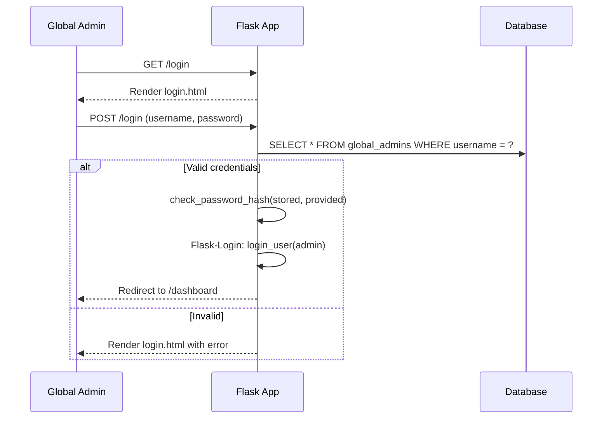

# 06 — Web API Endpoints & Dashboard

## 1. Overview

The Flask web application serves two roles:
1. **Server-side rendered dashboard** — HTML pages with Jinja2 templates for the global admin
2. **REST API** — JSON endpoints consumed by the dashboard's JavaScript for dynamic interactions

All endpoints require authentication except `/login`.

## 2. Authentication

### Endpoints

| Method | Path | Description | Auth |
|--------|------|-------------|------|
| `GET` | `/login` | Render login page | Public |
| `POST` | `/login` | Authenticate with username/password | Public |
| `GET` | `/logout` | Destroy session, redirect to login | Authenticated |

### Login Flow



### Session Management
- Uses Flask-Login with server-side sessions
- Session cookie: `HttpOnly`, `SameSite=Lax`, `Secure` (in production)
- Session timeout: configurable (default 8 hours)
- All dashboard routes decorated with `@login_required`

---

## 3. Dashboard Pages (Server-Side Rendered)

| Route | Template | Description |
|-------|----------|-------------|
| `/dashboard` | `dashboard.html` | Overview with stats cards and charts |
| `/dashboard/orders` | `orders.html` | Orders table with filters and search |
| `/dashboard/orders/<id>` | `order_detail.html` | Single order with status history |
| `/dashboard/customers` | `customers.html` | Customer list with bottle stats |
| `/dashboard/customers/<id>` | `customer_detail.html` | Customer profile, orders, bottles |
| `/dashboard/admins` | `admins.html` | Admin list with performance stats |
| `/dashboard/admins/<id>` | `admin_detail.html` | Admin profile, stock, deliveries |
| `/dashboard/admins/new` | `admin_form.html` | Add new admin form |
| `/dashboard/inventory` | `inventory.html` | Global bottle tracking overview |

### Dashboard Overview (`/dashboard`)

Displays:
- **Stats cards**: Total orders, Pending orders, Total customers, Active admins, Total bottles in system, Bottles in admin stock
- **Charts**: Orders per day (last 30 days), Orders by status (pie chart), Bottle flow (receipts vs deliveries over time)
- **Recent activity**: Last 10 order status changes

---

## 4. REST API Endpoints

All API endpoints return JSON. Prefix: `/api/v1`

### 4.1 Dashboard Stats

| Method | Path | Description |
|--------|------|-------------|
| `GET` | `/api/v1/stats` | Global statistics |

**Response:**
```json
{
    "total_orders": 150,
    "pending_orders": 12,
    "in_progress_orders": 5,
    "delivered_orders": 120,
    "canceled_orders": 13,
    "total_customers": 45,
    "active_admins": 3,
    "bottles": {
        "total_received": 500,
        "total_delivered": 380,
        "admin_stock": 120,
        "total_returned": 200,
        "customer_in_hand": 180,
        "pending_delivery": 45
    }
}
```

---

### 4.2 Orders

| Method | Path | Description |
|--------|------|-------------|
| `GET` | `/api/v1/orders` | List orders (paginated, filterable) |
| `GET` | `/api/v1/orders/<id>` | Single order detail |
| `PATCH` | `/api/v1/orders/<id>/status` | Update order status |
| `GET` | `/api/v1/orders/<id>/history` | Order status change log |

#### `GET /api/v1/orders`

**Query Parameters:**
| Param | Type | Default | Description |
|-------|------|---------|-------------|
| `page` | int | 1 | Page number |
| `per_page` | int | 20 | Items per page (max 100) |
| `status` | string | — | Filter: `pending`, `in_progress`, `delivered`, `canceled` |
| `customer_id` | int | — | Filter by customer |
| `admin_id` | int | — | Filter by assigned admin |
| `from_date` | ISO date | — | Orders created after this date |
| `to_date` | ISO date | — | Orders created before this date |
| `search` | string | — | Search customer name or phone |
| `sort` | string | `created_at` | Sort field |
| `order` | string | `desc` | Sort direction: `asc` or `desc` |

**Response:**
```json
{
    "items": [
        {
            "id": 45,
            "customer": {"id": 1, "full_name": "John Doe", "phone": "+1234567890"},
            "admin": {"id": 2, "full_name": "Admin User"} | null,
            "bottle_count": 5,
            "status": "pending",
            "notes": null,
            "created_at": "2026-03-30T14:30:00Z",
            "updated_at": "2026-03-30T14:30:00Z"
        }
    ],
    "total": 150,
    "page": 1,
    "per_page": 20,
    "pages": 8
}
```

#### `PATCH /api/v1/orders/<id>/status`

**Request:**
```json
{
    "status": "canceled",
    "note": "Customer unreachable",
    "version": 2
}
```

**Response (200):**
```json
{
    "id": 45,
    "status": "canceled",
    "version": 3,
    "updated_at": "2026-03-30T15:00:00Z"
}
```

**Response (409 Conflict):**
```json
{
    "error": "Order was modified by another user. Please refresh.",
    "current_version": 3
}
```

**Response (422 Unprocessable):**
```json
{
    "error": "Invalid transition from 'delivered' to 'pending'"
}
```

#### `GET /api/v1/orders/<id>/history`

**Response:**
```json
{
    "order_id": 45,
    "history": [
        {"old_status": null, "new_status": "pending", "changed_at": "2026-03-30T14:30:00Z", "changed_by": null, "note": null},
        {"old_status": "pending", "new_status": "in_progress", "changed_at": "2026-03-30T14:45:00Z", "changed_by": "Admin User", "note": null},
        {"old_status": "in_progress", "new_status": "delivered", "changed_at": "2026-03-30T16:00:00Z", "changed_by": "Admin User", "note": null}
    ]
}
```

---

### 4.3 Customers

| Method | Path | Description |
|--------|------|-------------|
| `GET` | `/api/v1/customers` | List customers (paginated, searchable) |
| `GET` | `/api/v1/customers/<id>` | Customer detail with bottle stats |
| `PATCH` | `/api/v1/customers/<id>` | Update customer (toggle active, edit details) |
| `GET` | `/api/v1/customers/<id>/orders` | Customer's order history |
| `GET` | `/api/v1/customers/<id>/bottles` | Bottle breakdown |

#### `GET /api/v1/customers`

**Query Parameters:** `page`, `per_page`, `search` (name or phone), `is_active`, `sort`, `order`

**Response:**
```json
{
    "items": [
        {
            "id": 1,
            "full_name": "John Doe",
            "phone": "+1234567890",
            "address": "123 Main St",
            "is_active": true,
            "total_orders": 12,
            "bottles_in_hand": 25,
            "created_at": "2026-01-15T10:00:00Z"
        }
    ],
    "total": 45,
    "page": 1,
    "per_page": 20,
    "pages": 3
}
```

#### `GET /api/v1/customers/<id>/bottles`

**Response:**
```json
{
    "customer_id": 1,
    "total_ordered": 60,
    "total_delivered": 55,
    "total_returned": 30,
    "bottles_in_hand": 25,
    "pending_bottles": 5
}
```

---

### 4.4 Admins

| Method | Path | Description |
|--------|------|-------------|
| `GET` | `/api/v1/admins` | List admins with stats |
| `POST` | `/api/v1/admins` | Add new admin |
| `GET` | `/api/v1/admins/<id>` | Admin detail |
| `PATCH` | `/api/v1/admins/<id>` | Update admin |
| `DELETE` | `/api/v1/admins/<id>` | Deactivate admin (soft delete) |
| `GET` | `/api/v1/admins/<id>/stock` | Admin's bottle inventory |

#### `POST /api/v1/admins`

**Request:**
```json
{
    "telegram_id": 123456789,
    "full_name": "New Admin",
    "phone": "+1234567890",
    "telegram_username": "newadmin"
}
```

**Response (201):**
```json
{
    "id": 4,
    "telegram_id": 123456789,
    "full_name": "New Admin",
    "is_active": true,
    "created_at": "2026-04-01T10:00:00Z"
}
```

#### `GET /api/v1/admins/<id>/stock`

**Response:**
```json
{
    "admin_id": 2,
    "total_received": 200,
    "total_delivered": 145,
    "current_stock": 55,
    "active_orders": 4,
    "pending_bottles": 12
}
```

#### `DELETE /api/v1/admins/<id>`

**Precondition**: Admin must have no `in_progress` orders. Returns 422 if they do.

**Response (200):**
```json
{
    "id": 2,
    "is_active": false,
    "message": "Admin deactivated"
}
```

---

### 4.5 Inventory

| Method | Path | Description |
|--------|------|-------------|
| `GET` | `/api/v1/inventory/overview` | Global bottle stats |
| `GET` | `/api/v1/inventory/receipts` | All supplier receipts |
| `GET` | `/api/v1/inventory/returns` | All customer returns |

#### `GET /api/v1/inventory/receipts`

**Query Parameters:** `page`, `per_page`, `admin_id`, `from_date`, `to_date`

**Response:**
```json
{
    "items": [
        {
            "id": 10,
            "admin": {"id": 2, "full_name": "Admin User"},
            "quantity": 50,
            "notes": "Weekly supplier delivery",
            "received_at": "2026-03-30T09:00:00Z"
        }
    ],
    "total": 25,
    "page": 1,
    "per_page": 20,
    "pages": 2
}
```

---

## 5. Error Responses

All API errors follow a consistent format:

```json
{
    "error": "Human-readable error message",
    "code": "ERROR_CODE"
}
```

| HTTP Status | Code | When |
|-------------|------|------|
| 400 | `BAD_REQUEST` | Invalid request body or parameters |
| 401 | `UNAUTHORIZED` | Not logged in |
| 404 | `NOT_FOUND` | Resource doesn't exist |
| 409 | `CONFLICT` | Optimistic locking conflict |
| 422 | `UNPROCESSABLE` | Business rule violation (invalid transition, insufficient stock) |
| 500 | `INTERNAL_ERROR` | Unexpected server error |

---

## 6. CSRF Protection

- All HTML forms include `{{ csrf_token() }}` via Flask-WTF
- API endpoints that modify data (`PATCH`, `POST`, `DELETE`) accept CSRF token via:
  - `X-CSRFToken` header (for AJAX requests)
  - Hidden form field (for form submissions)

## 7. Rate Limiting

Using Flask-Limiter with Redis or in-memory backend:

| Endpoint | Limit | Key |
|----------|-------|-----|
| `POST /login` | 5/minute | Per IP address |
| `POST /api/v1/*` | 60/minute | Per session |
| `PATCH /api/v1/*` | 30/minute | Per session |
| `DELETE /api/v1/*` | 10/minute | Per session |
| `GET /api/v1/*` | 120/minute | Per session |

Rate limit headers included in responses: `X-RateLimit-Limit`, `X-RateLimit-Remaining`, `X-RateLimit-Reset`.

Exceeded limit returns:
```json
{
    "error": "Too many requests. Please try again later.",
    "code": "RATE_LIMITED",
    "retry_after": 30
}
```

## 8. CORS Configuration

Same-origin only. API endpoints are consumed by the same Flask app's templates, so no cross-origin access is needed.

```python
from flask_cors import CORS
CORS(app, resources={r"/api/*": {"origins": "same-origin"}})
```

If API needs to be exposed externally in the future, configure allowed origins explicitly.

## 9. Account Lockout

Login flow includes brute-force protection:

1. On failed login: increment `global_admins.failed_login_attempts`
2. After 10 consecutive failures: set `locked_until = NOW() + 30 minutes`
3. While locked: reject all login attempts with "Account locked. Try again in {minutes} minutes."
4. On successful login: reset `failed_login_attempts = 0`, update `last_login_at`
5. First login after account creation: redirect to password change form (`must_change_password = TRUE`)

## 10. Data Export

| Method | Path | Description |
|--------|------|-------------|
| `GET` | `/api/v1/orders/export` | Export orders as CSV |
| `GET` | `/api/v1/customers/export` | Export customers as CSV |
| `GET` | `/api/v1/inventory/export` | Export inventory data as CSV |

All export endpoints accept the same filter parameters as their list counterparts. Response headers: `Content-Type: text/csv`, `Content-Disposition: attachment; filename="orders_2026-04-01.csv"`.
