# 08 — Implementation Sequence

## 1. Phase Overview

```mermaid
gantt
    title Implementation Phases
    dateFormat  X
    axisFormat %s

    section Phase 1: Foundation
    Project structure + config          :p1a, 0, 1
    Database models                     :p1b, 1, 2
    Migrations + seed                   :p1c, 2, 3

    section Phase 2: Business Logic
    customer_service                    :p2a, 3, 4
    order_service (state machine)       :p2b, 3, 5
    bottle_service (stock calc)         :p2c, 3, 5
    stats_service                       :p2d, 5, 6
    Unit tests                          :p2e, 5, 7

    section Phase 3: Telegram Bot
    Bot setup + auth middleware         :p3a, 7, 8
    Customer handlers                   :p3b, 8, 10
    Admin handlers                      :p3c, 8, 11
    Notifications                       :p3d, 11, 12

    section Phase 4: Web Dashboard
    Flask setup + auth                  :p4a, 12, 13
    Dashboard pages                     :p4b, 13, 16
    API endpoints                       :p4c, 13, 16

    section Phase 5: Polish
    Error handling + logging            :p5a, 16, 17
    Integration tests                   :p5b, 17, 18
    Docker setup                        :p5c, 18, 19
```



## 2. Phase 1: Foundation

### Step 1.1 — Project Structure
Create all directories and `__init__.py` files as defined in spec 07.

**Files:**
- All directories under `app/`, `bot/`, `web/`, `tests/`, `migrations/`
- `config.py`
- `.env.example`
- `.gitignore`
- `requirements.txt`
- `run_bot.py` (skeleton)
- `run_web.py` (skeleton)

### Step 1.2 — Database Setup
**File:** `app/database.py`

- Create SQLAlchemy `Base` class
- Create engine from `DATABASE_URL`
- Create `SessionLocal` sessionmaker for bot
- Create Flask-SQLAlchemy integration for web
- Helper: `get_session()` context manager for bot handlers

### Step 1.3 — Models
**Files:** `app/models/*.py`

Build order:
1. `customer.py` — no dependencies
2. `admin.py` — no dependencies
3. `global_admin.py` — no dependencies
4. `order.py` — depends on customer, admin
5. `order_status_log.py` — depends on order, admin
6. `bottle_receipt.py` — depends on admin
7. `bottle_return.py` — depends on customer, admin
8. `__init__.py` — imports all, exports `Base`

### Step 1.4 — Migrations
- Initialize Alembic: `flask db init`
- Generate initial migration: `flask db migrate -m "initial"`
- Apply: `flask db upgrade`

### Step 1.5 — Seed Script
**File:** `seed.py`

Creates:
- 1 global admin (username: `admin`, password: **randomly generated** and printed to console). The `must_change_password` flag is set to `TRUE` so the admin is forced to change it on first login.
- Optionally: test customers, admins, and orders (behind `--test-data` flag)

**Checkpoint:** Can connect to PostgreSQL, create tables, insert seed data.

---

## 3. Phase 2: Business Logic

### Step 2.1 — Customer Service
**File:** `app/services/customer_service.py`

Functions:
- `register_customer(session, telegram_id, full_name, address, phone) -> Customer`
- `get_customer_by_telegram_id(session, telegram_id) -> Customer | None`
- `update_customer(session, customer_id, **fields) -> Customer`
- `search_customers(session, query) -> list[Customer]`

### Step 2.2 — Order Service (Critical)
**File:** `app/services/order_service.py`

Functions:
- `create_order(session, customer_id, bottle_count) -> Order`
- `claim_order(session, order_id, admin_id, version) -> bool`
- `mark_delivered(session, order_id, admin_id, version) -> bool`
- `cancel_order(session, order_id, admin_id_or_none, version, reason) -> bool`
- `get_pending_orders(session) -> list[Order]`
- `get_admin_active_orders(session, admin_id) -> list[Order]`
- `get_customer_orders(session, customer_id, limit) -> list[Order]`
- `get_customer_pending_orders(session, customer_id) -> list[Order]`

Key concerns:
- State machine validation (reject invalid transitions)
- Optimistic locking (version check on all updates)
- Stock validation on delivery (`admin_stock >= bottle_count`)
- Audit logging (INSERT into order_status_log on every transition)

### Step 2.3 — Bottle Service
**File:** `app/services/bottle_service.py`

Functions:
- `record_receipt(session, admin_id, quantity, notes) -> BottleReceipt`
- `record_return(session, customer_id, admin_id, quantity) -> BottleReturn`
- `get_admin_stock(session, admin_id) -> int`
- `get_customer_bottles(session, customer_id) -> dict` (ordered, delivered, returned, in_hand)
- `get_admin_inventory(session, admin_id) -> dict` (received, delivered, stock, pending)

Key concerns:
- Stock is always calculated (SUM queries), never cached
- Return validation: `quantity <= customer_bottles_in_hand`
- Receipt validation: `quantity > 0`

### Step 2.4 — Stats Service
**File:** `app/services/stats_service.py`

Functions:
- `get_global_stats(session) -> dict` — for dashboard overview
- `get_orders_by_day(session, days) -> list[dict]` — for charts
- `get_orders_by_status(session) -> dict` — for pie chart
- `get_stale_orders(session, hours) -> list[Order]` — in_progress > N hours

### Step 2.5 — Unit Tests
**Files:** `tests/test_order_service.py`, `tests/test_bottle_service.py`, `tests/test_customer_service.py`

Test cases:
- All valid state transitions
- All invalid state transitions (assert rejection)
- Optimistic locking (simulate concurrent claims)
- Insufficient stock guard
- Return exceeds in-hand
- Edge cases: 0 bottles, max bottles, duplicate registration

**Checkpoint:** All service tests pass. Business logic is complete and verified.

---

## 4. Phase 3: Telegram Bot

### Step 3.1 — Bot Setup
**File:** `bot/main.py`

- Create `Application` with bot token
- Configure `PicklePersistence` (or PostgreSQL-backed) for conversation state survival across restarts
- Register scoped bot menu commands (`setMyCommands`) for customer and admin scopes
- Register all handlers (imported from `bot/handlers/`)
- Start polling (dev) or webhook (prod) based on `BOT_MODE` config

### Step 3.2 — Auth Middleware
**File:** `bot/middlewares/auth.py`

- `@require_customer` decorator — verifies telegram_id in customers table
- `@require_admin` decorator — verifies telegram_id in admins table
- Unauthorized access returns generic "Unknown command"

### Step 3.3 — Utilities
**Files:** `bot/utils/validators.py`, `bot/utils/formatters.py`, `bot/utils/notifications.py`

- Validators: phone regex, name length, bottle count range
- Formatters: format order details, stats, lists for Telegram messages
- Notifications: send to admin group, send to customer DM

### Step 3.4 — Customer Handlers
**Files:** `bot/handlers/start.py`, `order.py`, `reorder.py`, `my_orders.py`, `cancel.py`, `profile.py`, `switch_mode.py`

Build order:
1. `start.py` — registration flow (ConversationHandler) with phone normalization
2. `order.py` — place order flow (ConversationHandler) with delivery notes, address override, duplicate prevention, pending limit check
3. `reorder.py` — repeat last order (ConversationHandler, short)
4. `my_orders.py` — view history with pagination (callback query handler)
5. `cancel.py` — cancel pending (ConversationHandler)
6. `profile.py` — view/edit profile (ConversationHandler)
7. `switch_mode.py` — dual-role mode switching

### Step 3.5 — Admin Handlers
**Files:** `bot/handlers/admin_pending.py`, `admin_active.py`, `admin_receive.py`, `admin_returns.py`, `admin_customer.py`, `admin_stock.py`

Build order:
1. `admin_pending.py` — view + claim (callback queries)
2. `admin_active.py` — deliver/cancel (callback queries + ConversationHandler for cancel reason)
3. `admin_receive.py` — record receipt (ConversationHandler)
4. `admin_returns.py` — record returns (ConversationHandler)
5. `admin_customer.py` — customer lookup (ConversationHandler)
6. `admin_stock.py` — view stock (single handler)

### Step 3.6 — Keyboards
**Files:** `bot/keyboards/customer_kb.py`, `bot/keyboards/admin_kb.py`

Inline keyboard builders for:
- Bottle count selection (1, 2, 3, 5, 10, Custom)
- Order confirmation (Confirm, Change Address, Cancel)
- Pending orders list with Claim buttons
- Active orders with Delivered/Cancel buttons
- Profile edit options

**Checkpoint:** Bot responds to all commands. Can register, order, claim, deliver, receive, return. Notifications sent correctly.

---

## 5. Phase 4: Web Dashboard

### Step 4.1 — Flask App Factory
**File:** `web/__init__.py`

- `create_app()` function
- Register blueprints (auth, dashboard, api)
- Initialize Flask-SQLAlchemy, Flask-Login, Flask-WTF
- Configure CSRF protection

### Step 4.2 — Authentication
**Files:** `web/auth/routes.py`, `web/auth/forms.py`

- Login form (WTForms)
- Login/logout routes
- Flask-Login user loader (loads GlobalAdmin from DB)

### Step 4.3 — Base Template
**File:** `web/templates/base.html`

- Sidebar navigation: Dashboard, Orders, Customers, Admins, Inventory
- Top nav with logged-in user and logout
- Content block for page-specific content
- CSS framework: Bootstrap 5 (via CDN) or Tailwind

### Step 4.4 — Dashboard Pages
**Files:** `web/dashboard/routes.py`, `web/templates/dashboard.html`, etc.

Build order:
1. `dashboard.html` — stats cards + charts (uses Chart.js)
2. `orders.html` — table with filters (status, date range, search)
3. `order_detail.html` — order info + status history + status update form
4. `customers.html` — table with search
5. `customer_detail.html` — profile + bottle stats + order history
6. `admins.html` — table with performance stats
7. `admin_detail.html` — profile + stock + delivery stats
8. `admin_form.html` — add new admin
9. `inventory.html` — global bottle overview + receipts/returns tables

### Step 4.5 — API Endpoints
**Files:** `web/api/orders.py`, `customers.py`, `admins.py`, `inventory.py`, `stats.py`

All endpoints per spec 06. Used by dashboard JavaScript for:
- Dynamic filtering without page reload
- Status updates via PATCH
- AJAX search

**Checkpoint:** Web dashboard loads, login works, all pages display data, status updates work, admin management works.

---

## 6. Phase 5: Polish

### Step 5.1 — Error Handling
- Bot: global error handler in `bot/handlers/error.py` — logs errors, sends "Something went wrong" to user
- Bot: notification failure handler — catches `telegram.error.Forbidden`, sets `notification_blocked` flag, warns admin
- Bot: database connection error handler — shows "Service temporarily unavailable"
- Bot: message length handling — split messages exceeding 4096 chars
- Web: Flask error handlers for 404, 500 — renders error templates
- Web: rate limit exceeded handler (429) — JSON error with retry_after
- API: consistent JSON error format with error codes

### Step 5.2 — Logging
- Structured logging with Python `logging` module
- Log levels: DEBUG (dev), INFO (prod)
- Log: order created/claimed/delivered, bot errors, web errors, auth attempts

### Step 5.3 — Integration Tests
- Test full bot conversation flows (using python-telegram-bot test utilities)
- Test web dashboard page loads
- Test API endpoint request/response cycles

### Step 5.4 — Docker Setup
```
docker-compose.yml:
  - postgres (port 5432)
  - bot (run_bot.py)
  - web (run_web.py, port 5000)
```

### Step 5.5 — README
- Setup instructions (local + Docker)
- Environment variables reference
- How to create first global admin
- How to add Telegram admins

---

## 7. Critical Path

These files must be implemented correctly for the system to work. Bugs here cascade everywhere:

1. **`app/services/order_service.py`** — State machine + optimistic locking. If transitions are wrong, orders get stuck or skip states. If locking fails, two admins can claim the same order.

2. **`app/models/order.py`** — The Order model with version column, status CHECK constraint, and relationships. Every other component reads/writes orders.

3. **`app/services/bottle_service.py`** — Stock calculations. If wrong, admins deliver bottles they don't have, or return counts are off.

4. **`app/database.py`** — Dual session setup. If the bot's session management leaks connections or the Flask session scoping is wrong, everything breaks under load.

5. **`bot/handlers/admin_pending.py`** — The claiming flow demonstrates the optimistic locking pattern used throughout all admin handlers.

---

## 8. Testing Strategy

| Layer | Tool | What to Test |
|-------|------|-------------|
| Models | pytest + test DB | Constraints, relationships, defaults |
| Services | pytest + test DB | State transitions, calculations, edge cases |
| Bot handlers | pytest-asyncio + mocked bot | Conversation flows, correct service calls |
| Web routes | Flask test client | Page loads, redirects, auth enforcement |
| API endpoints | Flask test client | Request/response format, status codes, filters |
| Integration | All of the above | End-to-end flows spanning multiple layers |

**Test database**: Separate PostgreSQL database (`water_dis_test`), recreated before each test run.
